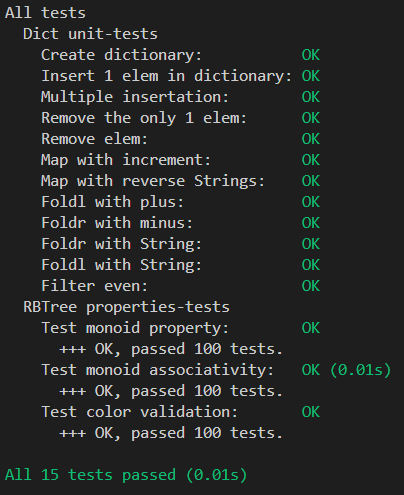

# Лабораторная работа №2

Дмитриев Андрей Иванович P3334  
Структура данных: RedBlack Tree  
Интерфейс: Bag

## Требования к разработанному ПО

1. Функции:
    - добавление и удаление элементов
    - фильтрация
    - отображение (map)
    - свертки (левая и правая)
    - структура должна быть моноидом
2. Структура данных должна быть неизменяемой
3. Библиотека должна быть протестирована в рамках unit-testing
4. Библиотека должна быть протестирована в рамках property-based тестирования (как минимум 3 свойства, включая свойства моноида)
5. Структура данных должна быть полиморфной
6. Требуется использовать идиоматичный для технологии стиль программирования

## Реализация структуры данных

Структура данных RedBlack Tree реализована в [RBBag](src/RBBag.hs)  
Основано на Okasaki (Functional Data Structures)

Интерфейс Bag реализован в [Bag](src/Bag.hs)

### Типы

```haskell
data Color = Red | Black deriving (Show, Eq)

data RBBag a
  = Leaf
  | Node
      { element :: a,
        count :: Int,
        color :: Color,
        leftChild :: RBBag a,
        rightChild :: RBBag a
      }
  deriving (Show)
```

### Вставка

Происходит поиск нужного места и на него вставляется красный Node. Далее происходит балансировка, проверяющая и исправляющая Red-Red случаи.
При попытке вставить элемент с уже существующим ключом, у него увеличивается счетчик.

```haskell
insert' :: (Ord a) => a -> RBBag a -> RBBag a
insert' el d = makeBlack $ insertHelper el d

insertHelper :: (Ord a) => a -> RBBag a -> RBBag a
insertHelper el Leaf = Node el 1 Red Leaf Leaf
insertHelper el node@Node {element = e, count = c, leftChild = left, rightChild = right}
  | el < e = balance (node {leftChild = insertHelper el left})
  | el > e = balance (node {rightChild = insertHelper el right})
  | otherwise = node {count = c + 1}
```

### Удаление

При удалении элемента из красно-черного дерева сначала находят и удаляют узел, после чего сливают его левое и правое поддеревья (если необходимо). Затем балансируют дерево, выполняя соответствующие операции balL и balR.

```haskell
remove' :: (Ord a) => a -> RBBag a -> RBBag a
remove' k dict = makeBlack $ del k dict

del :: (Ord a) => a -> RBBag a -> RBBag a
del _ Leaf = Leaf
del k node@Node {element = nk, leftChild = left, rightChild = right}
  | k < nk = delL k node
  | k > nk = delR k node
  | otherwise = fuse left right
```

### Дополнительные операции

Реализованы дополнительные операции над мультимножеством: foldr'', foldl'', map', filter'.

```haskell
map' :: (Ord b) => (a -> b) -> RBBag a -> RBBag b
map' _ Leaf = Leaf
map' f node@Node {element = el, count = cnt, leftChild = left, rightChild = right} = 
    Node (f el) cnt (color node) (map' f left) (map' f right)

foldl'' :: (Ord a) => ((a, Int) -> b -> b) -> b -> RBBag a -> b
foldl'' _ acc Leaf = acc
foldl'' f acc (Node {element = el, count = cnt, leftChild = left, rightChild = right}) = foldl'' f (f (el, cnt) (foldl'' f acc left)) right

foldr'' :: (Ord a) => ((a, Int) -> b -> b) -> b -> RBBag a -> b
foldr'' _ acc Leaf = acc
foldr'' f acc (Node {element = el, count = cnt, leftChild = left, rightChild = right}) = foldr'' f (f (el, cnt) (foldr'' f acc right)) left

filter' :: (Ord a) => ((a, Int) -> Bool) -> RBBag a -> RBBag a
filter' p = foldr'' (\(k, c) d -> if p (k, c) then insertMany k c d else d) mempty 
```

## Тестирование

### Тесты для интерфейса

Тесты написаны с помощью HUnit. Реализованы в [TestBag](test/TestBag.hs)
Проверяется создание, вставка, удаление, map, foldl, foldr, filter

### Тесты структуры данных

Проводится property-based testing при помощи QuickCheck.
Реализованы в [PropertyTestRBBag](test/PropertyTestRBBag.hs)

Проверяются:

1. Свойства Моноида (нейтральный элемент, ассоциативность)
2. Свойства красно-черного дерева (корректность раскраски)

### Отчет по тестированию


